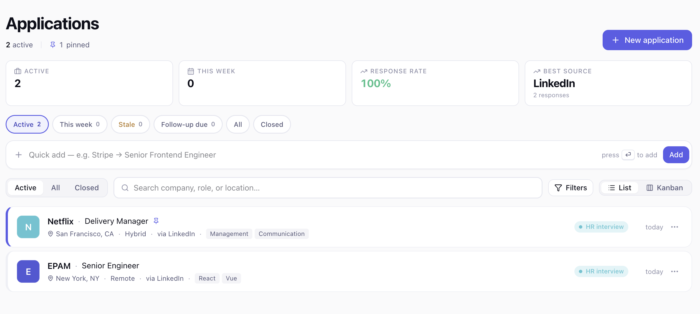
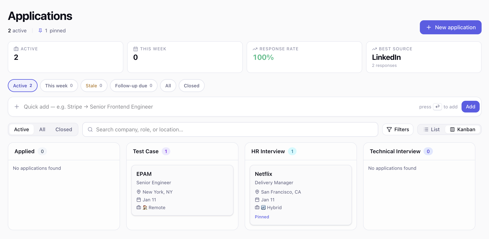
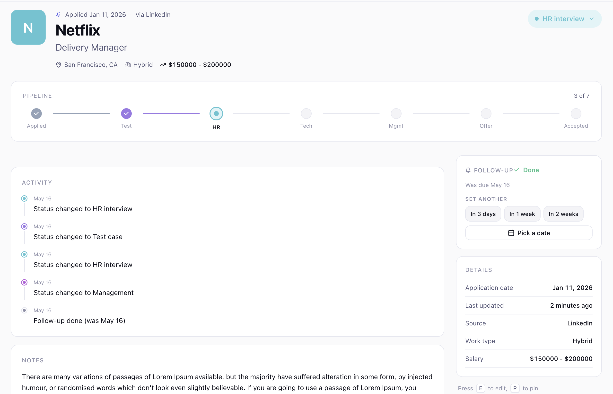
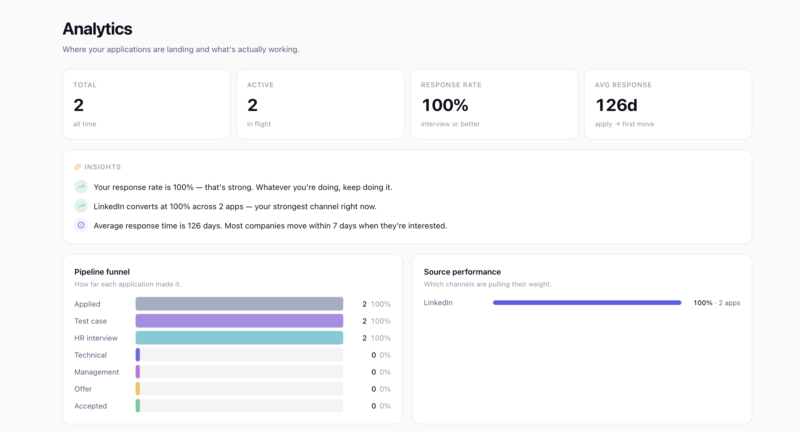

# JobTrack — Your Job Hunt's Command Center

Track every application, follow up on time, and see what's actually working. Free, forever.

**🌐 Live: [jobapplytracker.com](https://jobapplytracker.com)**


---

## What it does

The job-search loop is messy: spreadsheets that started clean and ended unreadable, follow-ups that slipped, no idea which channels were actually converting. JobTrack replaces the spreadsheet with a calm, opinionated tracker that knows about real-world job-hunt mechanics — kanban progress, follow-up reminders that actually email you, drag-paste a job URL to autofill the form, import from CSV, share a stripped-down stats profile, and a per-application activity log so you can see what moved when.

It's a full-stack TypeScript app built on Next.js 16 (App Router, RSC), Supabase (Postgres + Auth + Storage), Resend for outbound mail, and Vercel for hosting + cron.

---

## Visual tour

<p align="center">
  
</p>

<p align="center">
  <em>List view — pipeline health strip, quick filter chips, sortable list.</em>
</p>

<p align="center">
  
</p>

<p align="center">
  <em>Kanban — drag applications across stages, sticky horizontal scroll.</em>
</p>

<p align="center">
  
</p>

<p align="center">
  <em>Detail — pipeline progress, real activity timeline, follow-up reminder card, details sidebar.</em>
</p>

<p align="center">
  
</p>

<p align="center">
  <em>Analytics — funnel, source performance, conversational insights.</em>
</p>

> Dark-mode variants are bundled at `public/*_dark.png` and used automatically when the visitor's system or theme preference is dark.

---

## Feature catalog

### Capture

- **Paste a job URL → autofill.** Server-side scraper (`/api/jobs/parse`) tries schema.org `JobPosting` JSON-LD first (covers Greenhouse, Lever, Workable, Ashby, SmartRecruiters), then LinkedIn-specific DOM hooks, then OpenGraph, then page title heuristics. SSRF-safe (blocks private hosts, 12s timeout, auth-gated). Pulls company, role, location, JD content, work type, source, and salary range when present.
- **Quick add bar.** "Company → Role" inline form at the top of the list — 30-second new entry without leaving the page.
- **CSV import.** papaparse-based ingestion with header auto-detection (EN+TR synonym table), status/work-type/date aliasing (`phone screen` → `hr_interview`, `DD/MM/YYYY` → ISO), per-row validation with skip-and-continue on errors, override-able column mapping in the preview step. Sample CSV download included.
- **Resume attachments.** Per-application PDF upload (≤2 MB) to a private Supabase Storage bucket with per-user RLS.

### Track

- **8-stage pipeline.** Applied → Test Case → HR Interview → Technical Interview → Management Interview → Offer → Accepted / Rejected. Status changes log to the activity feed.
- **Drag-and-drop kanban.** Edge-scroll while dragging, always-visible scrollbar so the off-screen columns are obvious.
- **List view.** Pinned-first, recent-first sort, inline status pills, follow-up badges (Overdue Nd / Follow up today / Follow up in Nd).
- **Pipeline health strip.** Active count · This week · Response rate % · either Follow-ups due (red when > 0) or Best converting source.
- **Quick filter chips.** Active / This week / Stale / Follow-up due / All / Closed, each with a live count.
- **Cmd+K command palette.** Jump to any application by name, or to Applications / Analytics / Settings / New Application.

### Engage

- **Follow-up reminders.** Pick a date (preset chips or calendar). When the date arrives the daily cron at `08:00 UTC` (`/api/cron/follow-ups`) emails the user via Resend, grouped per user (one email per inbox per day, no spam). Idempotent via `follow_up_sent_at` stamping. Snooze (+1d / +3d / +1w), Mark done, Reschedule, Clear — all inline in the detail sidebar.
- **Activity event log.** Real `activity_events` table; the timeline shows every status change, note, resume upload, follow-up set/done, pin/unpin, and creation event with payload-aware labels.
- **Quick notes.** Add an inline note from the detail page without opening the full edit form.

### Analytics

- Funnel by stage, source performance bars, average-response-time, conversational insights (`"Your response rate is 100% — that's strong. Whatever you're doing, keep doing it."`).
- Per-user rendering — every figure is RLS-scoped.

### Share

- **Public profile** at `/u/[handle]`. Opt-in, picks a unique handle (case-insensitive, 2–32 chars, reserved-name list). Shows applications count, response rate, offers, weekly streak, funnel %, top sources. Optional company highlights (off by default — good for stealth job hunts). Dynamic OG image at `/u/[handle]/og` so shared links preview with the user's actual stats. Sitemap auto-discovers opted-in handles.

### Account & Settings

- **Theme toggle** (light / dark / system) — works for logged-out visitors on the landing page too.
- **i18n** — English + Türkçe across landing, login, settings, status labels. Inline language switcher in the landing header for logged-out visitors.
- **Custom sources & industries** — bend the source/industry pickers to your search style.
- **Hide rejected** toggle to focus the active pipeline.
- **Follow-up email** opt-in toggle (synced to `user_settings.follow_up_emails`, respected by the cron).
- **Public profile** card with handle picker, live availability check, display name, show-companies toggle, copy link.
- **Export to JSON** — full dump of your applications + settings.
- **Clear all data** — wipes apps, activity, resumes, settings on the server. Sign-in preserved.
- **Delete account** — type-DELETE-to-confirm; cascades via FK deletes on `auth.users`. Resume files removed from storage. Signs out + redirects home.

### Auth

- Email + password, Google OAuth, GitHub OAuth, passwordless magic links — all via Supabase Auth.
- Password-reset flow, password strength meter on signup.
- Middleware-enforced route protection.

### Polish

- **PWA installable.** Dynamic manifest + apple-touch-icon, SVG favicon multi-size ICO fallback.
- **Privacy + Terms pages** at `/privacy` and `/terms` with shared `JtLegalShell` and readable typography.
- **Sitemap + robots.txt** auto-generated, public profiles included.
- **Dynamic OG image** at `/opengraph-image` for the home page, separate per-handle generator for public profiles.
- **Toast feedback** (sonner) on every mutation.
- **Skeleton loaders** for application list and detail.
- **Mobile bottom nav**, in-app new-app form sticky save bar on mobile, inline footer on desktop.

---

## Tech stack

### Frontend

| Tool             | Purpose                                                           |
| ---------------- | ----------------------------------------------------------------- |
| Next.js 16       | App Router, RSC, route handlers, dynamic OG via `ImageResponse`   |
| React 19         | UI                                                                |
| TypeScript 5     | Strict types end-to-end                                           |
| Tailwind CSS 4   | Utility styling                                                   |
| shadcn/ui        | Accessible primitives (Dialog, Popover, Command, Dropdown, etc.)  |
| Radix UI         | Underlying headless primitives                                    |
| Zustand          | Client store with optimistic mutations                            |
| React Hook Form  | Form state                                                        |
| date-fns         | Date math + formatting                                            |
| Lucide React     | Icon set                                                          |
| Sonner           | Toasts                                                            |
| cmdk             | Command palette                                                   |
| next-intl        | EN / TR localization                                              |
| next-themes      | Theme switching                                                   |

### Backend / data

| Tool             | Purpose                                                           |
| ---------------- | ----------------------------------------------------------------- |
| Supabase         | Postgres + Auth + Storage + RLS                                   |
| Resend           | Outbound transactional email (follow-up reminders)                |
| Vercel           | Hosting + cron (`vercel.json` daily schedule)                     |
| cheerio          | HTML parsing for the URL-paste autofill                           |
| papaparse        | CSV parser for import flow                                        |
| sharp            | Build-time favicon ICO generation from the SVG brand mark         |

---

## Architecture

```
┌──────────────────────────────────────────────────────────────┐
│                    Browser (RSC + Client)                    │
│  Landing • Login • /applications • /analytics • /u/[handle]  │
└─────────────┬────────────────────────────────────────────────┘
              │
   ┌──────────┼──────────────────────────────────────────────┐
   │          │                                              │
   ▼          ▼                                              ▼
┌────────┐  ┌──────────────────────┐    ┌──────────────────────────┐
│ Server │  │ /api/jobs/parse      │    │ /api/cron/follow-ups     │
│ Actions│  │ (cheerio scraper,    │    │ (Bearer-auth, service    │
│        │  │  auth-gated)         │    │  role, daily 08:00 UTC)  │
└────────┘  └──────────────────────┘    └─────────────┬────────────┘
   │                  │                                │
   │                  │                                ▼
   │                  │                       ┌─────────────────┐
   │                  │                       │ Resend          │
   │                  │                       │ (verified domain)│
   │                  │                       └─────────────────┘
   ▼                  ▼
┌──────────────────────────────────────────────────────────────┐
│                         Supabase                             │
│  Auth · Postgres (RLS) · Storage (resumes/)                  │
│  Tables: applications · activity_events · user_settings      │
│          skill_suggestions                                   │
└──────────────────────────────────────────────────────────────┘
```

### Data model

```
auth.users
   ▲       ▲       ▲
   │       │       │  ON DELETE CASCADE
   │       │       │
   │       │       └─── user_settings
   │       │              · hide_rejected, custom_sources, custom_industries
   │       │              · follow_up_emails
   │       │              · public_handle (unique), public_enabled,
   │       │                public_show_companies, public_display_name
   │       │
   │       └─── applications
   │              · status (enum), work_type (enum), is_pinned
   │              · follow_up_date, follow_up_sent_at,
   │                follow_up_completed_at
   │              · contacts (jsonb), skills (text[])
   │              ▲
   │              │  ON DELETE CASCADE
   │              │
   │              └─── activity_events  (append-only)
   │                     · kind, payload (jsonb)
   │
   └─── storage.objects in resumes/{user_id}/{app_id}/resume.pdf
```

RLS is enforced on every user-owned table — direct queries are scoped by `auth.uid()`. The cron worker uses the service-role key only inside the Bearer-gated route, never on the client.

---

## Getting started (local)

### Prerequisites

- Node 18+
- A Supabase project (free tier is fine)
- A Resend account if you want follow-up emails to actually send locally

### Setup

```bash
git clone https://github.com/berkinduz/job-apply-tracker.git
cd job-apply-tracker
npm install
cp .env.example .env.local   # then fill in the values below
```

### Environment variables

```env
# Supabase — both client and server
NEXT_PUBLIC_SUPABASE_URL=https://xxxx.supabase.co
NEXT_PUBLIC_SUPABASE_ANON_KEY=eyJ...

# Server-only (never expose to the browser)
SUPABASE_SERVICE_ROLE_KEY=eyJ...

# Public URL — used in OG, sitemap, email links
NEXT_PUBLIC_SITE_URL=http://localhost:3000

# Follow-up email cron
CRON_SECRET=long-random-string                # openssl rand -hex 32
RESEND_API_KEY=re_xxx                         # optional locally
EMAIL_FROM=JobTrack <reminders@example.com>   # optional; default is set in code
```

### Database

Apply the SQL files in `supabase-*.sql` in order via the Supabase SQL editor, or rebuild from the migrations history in `src/types/database.ts`. Key tables: `applications`, `user_settings`, `activity_events`, `skill_suggestions`.

Don't forget to:

- Enable Row Level Security on every user table (each has its own policy).
- Create the private `resumes` storage bucket with per-folder RLS (`(storage.foldername(name))[1] = auth.uid()::text`).
- Turn on "Leaked password protection" under Auth → Policies.
- Connect a custom SMTP (or use Supabase's default for testing — rate-limited to 3 mails/hour).

### Run it

```bash
npm run dev
# Landing  → http://localhost:3000
# App      → http://localhost:3000/applications
```

### Test the cron locally

```bash
curl -i -H "Authorization: Bearer $CRON_SECRET" \
  http://localhost:3000/api/cron/follow-ups
```

Without `RESEND_API_KEY`, the route returns `{ ok: true, sent: 0, errors: [...] }` with a reason-skipped notice — useful while you wire Resend up.

---

## Project structure

```
src/
├── app/
│   ├── api/
│   │   ├── cron/follow-ups/route.ts    # daily reminder worker
│   │   └── jobs/parse/route.ts         # URL paste autofill
│   ├── applications/                   # list, new, detail, edit (RSC)
│   ├── analytics/                      # analytics page
│   ├── auth/                           # OAuth callback
│   ├── login/                          # email/OAuth/magic link
│   ├── onboarding/                     # 3-step welcome flow
│   ├── settings/                       # account, theme, customization, danger zone
│   │   ├── danger-actions.ts           # clearAllData + deleteAccount
│   │   └── public-profile-actions.ts   # handle pick + save profile
│   ├── u/[handle]/                     # public profile + dynamic OG
│   ├── privacy/  terms/                # legal pages
│   ├── icon.svg  apple-icon.tsx        # favicon assets
│   ├── manifest.ts  robots.ts  sitemap.ts
│   └── opengraph-image.tsx             # landing OG generator
├── components/
│   ├── jt/                             # "Design v2" components — app shell,
│   │   ├── app-shell.tsx               # header + nav + Cmd+K palette
│   │   ├── application-form.tsx        # new/edit form with URL paste autofill
│   │   ├── application-detail.tsx      # detail page
│   │   ├── application-detail-extras.tsx  # pipeline, timeline, follow-up card
│   │   ├── applications-page.tsx       # list + kanban + filters
│   │   ├── csv-import-dialog.tsx       # CSV import wizard
│   │   ├── landing.tsx                 # marketing homepage
│   │   ├── login.tsx                   # auth screen
│   │   ├── onboarding.tsx              # 3-step welcome
│   │   ├── public-profile.tsx          # /u/[handle] renderer
│   │   ├── public-profile-card.tsx     # settings card
│   │   ├── primitives.tsx              # JtButton, JtPill, JtDot, status tokens
│   │   └── settings.tsx                # the settings page
│   ├── applications/                   # list/card/kanban (data-bound)
│   └── ui/                             # shadcn primitives
├── lib/
│   ├── csv/import.ts                   # papaparse + auto-detect + alias map
│   ├── email/send.ts                   # Resend wrapper + email shell
│   ├── jobs/parse.ts                   # cheerio JD scraper
│   ├── public-profile/stats.ts         # funnel aggregation
│   └── supabase/                       # browser, server, admin (service-role)
│       ├── applications.ts             # CRUD + bulk + follow-up
│       └── activity.ts                 # event log writer + reader
├── messages/{en,tr}.json               # i18n
├── store/index.ts                      # Zustand store (applications + settings)
├── i18n/request.ts                     # next-intl setup
└── types/                              # JobApplication, ActivityEvent, Database
```

---

## Deployment

The app deploys cleanly to Vercel — push to `main`, Vercel rebuilds, Cron picks up `vercel.json` automatically.

### Production checklist

- [ ] `NEXT_PUBLIC_SUPABASE_URL`, `NEXT_PUBLIC_SUPABASE_ANON_KEY` set in Vercel
- [ ] `SUPABASE_SERVICE_ROLE_KEY` set (marked **Sensitive**)
- [ ] `NEXT_PUBLIC_SITE_URL=https://yourdomain.com`
- [ ] `CRON_SECRET` set (marked **Sensitive**) — a fresh `openssl rand -hex 32`
- [ ] `RESEND_API_KEY` set (marked **Sensitive**) and the sending domain verified (SPF + DKIM)
- [ ] `EMAIL_FROM=JobTrack <reminders@yourdomain.com>`
- [ ] Storage bucket `resumes` exists, private, with the per-user RLS policy
- [ ] `auth.users` leaked-password protection enabled in Supabase dashboard
- [ ] Vercel Cron lists `/api/cron/follow-ups` at the daily schedule

The HANDOFF doc (`HANDOFF.md`) walks through the rest of the manual setup if you're forking this and going to production with it.

---

## What's next

Built, not yet built:

- **Email forwarding** — `you@inbox.jobtrack.app` → forward a job listing email, auto-create application. Resend inbound webhook + HTML extractor.
- **Browser extension** — "Track in JobTrack" button on LinkedIn / Indeed job pages. Manifest v3 + popup auth flow.
- **AI features** (gated behind a future paid tier) — JD summarizer, cover-letter draft from JD + resume, interview prep prompts.
- **Notification preferences** — per-kind opt-in (only today, only overdue, weekly digest).
- **Bulk actions** — multi-select on the list view for bulk status change / bulk archive.

---

## License

MIT — see [LICENSE](LICENSE).

## Author

**Berkin Duz**

- Website — [berkinduz.com](https://berkinduz.com)
- GitHub — [@berkinduz](https://github.com/berkinduz)
- ☕ [Buy me a coffee](https://buymeacoffee.com/berkinduz)

---

<div align="center">
  <p>If JobTrack helps you land your next role, a ⭐ on the repo is the nicest way to say thanks.</p>
</div>
